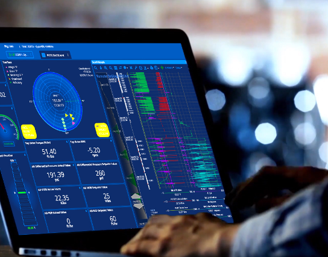

The right information at the right time eliminates the need to search through different sources of data for the best path forward.

## RigCloud

LiveOps is an web and mobile application to streaming analytics from diferent operations on the drilling industry and enhance remote control and deliver in real-time directionals and infrastructure in a transparency process, build with a combination on the frontend of React, Angular and SCSS I was able to build the mayority of drilling widgets and components ASAP for the company. 

